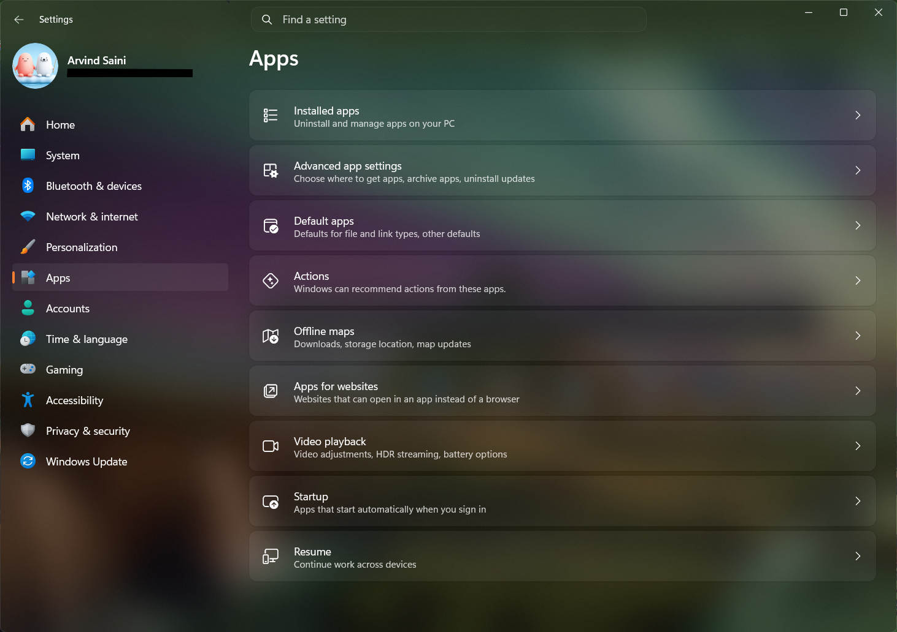

# Translucent Seamless theme for Windows 11 Settings Styler

A borderless, seamless frosted acrylic theme for the Windows 11 Settings app featuring unified glass styling, hidden card outlines, and no dividing sidebar seams.

**Author**: [ArvindSaini978](https://github.com/ArvindSaini978)  
**Credits**: Based on Translucent Settings 11 by [Link Vegas](https://github.com/linkvegas12).



## Key Highlights
- **Full Expanded Sidebar**: Keeps navigation labels fully visible while seamlessly blending the sidebar into the content canvas[cite: 1, 4].
- **Seamless Seam Removal**: Eliminates dividing borders and vertical seams between the navigation pane and the main window[cite: 1].
- **Unified Frosted Acrylic**: Coordinates backdrop tinting and blur luminosity across the titlebar, sidebar, and content area[cite: 1].
- **Border & Card Outline Removal**: Strips out card outlines and elevation strokes for a clean floating look[cite: 1].
- **Enhanced Rounding**: Applies smooth corner radiuses across cards, search controls, and list items[cite: 1].

## Manual installation

The theme styles can be imported manually:

* Open the **Windows 11 Settings Styler** mod in Windhawk.
* Go to the **Settings** tab and select **Textual mode** (via the three dots `...` in the top right).
* Copy the content below, paste it into the editor, and click **Save settings**.

<details>
<summary>Content to import (click to expand)</summary>

```yaml
styleConstants:
  - OutRadius=8
  - InRadius=10
  - BgBorder=<SolidColorBrush Color="#00000000"/>

themeResourceVariables:
  - Overlay@Light=#55FFFFFF
  - Overlay@Dark=#09FFFFFF
  - Border@Light=#00000000
  - Border@Dark=#00000000
  - Accent@Dark={ThemeResource SystemAccentColorLight2}
  - Accent@Light={ThemeResource SystemAccentColorDark1}
  - WindowCaptionBackground@Dark=#00000000
  - WindowCaptionBackground@Light=#00000000
  - WindowCaptionBackgroundDisabled@Dark=#00000000
  - WindowCaptionBackgroundDisabled@Light=#00000000
  - SolidBackgroundFillColorBase@Dark=#00000000
  - SolidBackgroundFillColorBase@Light=#00000000
  - SolidBackgroundFillColorSecondary@Dark=#00000000
  - SolidBackgroundFillColorSecondary@Light=#00000000
  - LayerFillColorDefault@Dark=#00000000
  - LayerFillColorDefault@Light=#00000000
  - ApplicationPageBackgroundThemeBrush@Dark=#00000000
  - ApplicationPageBackgroundThemeBrush@Light=#00000000
  - CardStrokeColorDefault@Dark=#00000000
  - CardStrokeColorDefault@Light=#00000000
  - ControlStrokeColorDefault@Dark=#00000000
  - ControlStrokeColorDefault@Light=#00000000
  - SurfaceStrokeColorDefault@Dark=#00000000
  - SurfaceStrokeColorDefault@Light=#00000000
  - NavigationViewItemSeparatorForeground@Dark=#00000000
  - NavigationViewItemSeparatorForeground@Light=#00000000
  - SystemControlForegroundBaseLowBrush@Dark=#00000000
  - SystemControlForegroundBaseLowBrush@Light=#00000000
  - SplitViewPaneBorderBrush@Dark=#00000000
  - SplitViewPaneBorderBrush@Light=#00000000
  - NavigationViewBorderBrush@Dark=#00000000
  - NavigationViewBorderBrush@Light=#00000000

controlStyles:
  - target: SystemSettings.View.SettingsExpander > Grid > SystemSettings.View.ExpanderToggleButton#ContainerButton > ContentPresenter#ContentPresenter
    styles:
      - CornerRadius:=12,12,12,12

  - target: SystemSettings.View.SpacingStackPanel > ContentPresenter > SystemSettings.View.EntityItem > Grid
    styles:
      - CornerRadius:=12

  - target: SystemSettings.View.EntityItem#BluetoothRadioToggleEntityItem > Grid
    styles:
      - CornerRadius:=12

  - target: SystemSettings.View.TwoSegmentsHeroUserControl#DefaultOneSegmentHeroUserControl > Grid#LayoutRoot > Grid#LeftLayout > ContentPresenter > ItemsControl > ItemsPresenter > StackPanel > ContentPresenter > StackPanel > Button > ContentPresenter#ContentPresenter
    styles:
      - CornerRadius:=12
      - Width=250

  - target: SystemSettings.View.SettingsExpander > Grid > ContentPresenter#RevealedContent
    styles:
      - CornerRadius:=12

  - target: Windows.UI.Xaml.Controls.Primitives.ListViewItemPresenter > SystemSettings.View.EntityItem > Grid
    styles:
      - CornerRadius:=$InRadius

  - target: SystemSettings.View.SettingsListViewItem > Windows.UI.Xaml.Controls.Primitives.ListViewItemPresenter > Border
    styles:
      - CornerRadius:=$InRadius

  - target: SystemSettings.View.ButtonEntityItem > Button#ContainerButton > ContentPresenter#ContentPresenter
    styles:
      - CornerRadius:=$InRadius

  # 1. Sidebar & Navigation
  - target: Grid#PaneRoot
    styles:
      - Background:=<AcrylicBrush BackgroundSource="HostBackdrop" FallbackColor="#00000000" TintColor="#101010" TintLuminosityOpacity="0.45" TintOpacity="0.4"/>
      - BorderThickness=0
      - BorderBrush:=<SolidColorBrush Color="#00000000"/>

  # 2. SplitView Pane Dividers and Borders
  - target: SplitView#RootSplitView
    styles:
      - PaneBorderThickness=0
      - BorderThickness=0
      - PaneBorderBrush:=<SolidColorBrush Color="#00000000"/>
      - BorderBrush:=<SolidColorBrush Color="#00000000"/>

  - target: SplitView#RootSplitView > Grid > Rectangle
    styles:
      - Visibility=Collapsed
      - Width=0

  - target: SplitView#RootSplitView > Grid > Border#PaneBorder
    styles:
      - BorderThickness=0
      - Visibility=Collapsed

  # 3. Main Content Area
  - target: SplitView#RootSplitView > Grid > Grid#ContentRoot
    styles:
      - Margin=-2,0,0,0
      - Background:=<SolidColorBrush Color="#00000000"/>

  - target: SplitView#RootSplitView > Grid > Grid#ContentRoot > Border
    styles:
      - BorderThickness=0
      - BorderBrush:=<SolidColorBrush Color="#00000000"/>

  - target: SplitView#RootSplitView > Grid > Grid#ContentRoot > Border > Grid#ContentGrid
    styles:
      - Background:=<AcrylicBrush BackgroundSource="HostBackdrop" FallbackColor="#00000000" TintColor="#101010" TintLuminosityOpacity="0.45" TintOpacity="0.4"/>
      - CornerRadius=0
      - BorderThickness=0
      - BorderBrush:=<SolidColorBrush Color="#00000000"/>

  # 4. Containers
  - target: Grid#ContentRoot
    styles:
      - Background:=<SolidColorBrush Color="#00000000"/>

  - target: Grid#ContentRoot > Border > Grid#ContentGrid > ContentControl#HeaderContent
    styles:
      - Background:=<SolidColorBrush Color="#00000000"/>

  - target: Frame#PermanentNavRootFrame
    styles:
      - Background:=<SolidColorBrush Color="#00000000"/>

  - target: SystemSettings.View.RootPage > Grid#RootPageGrid
    styles:
      - Background:=<SolidColorBrush Color="#00000000"/>

  - target: Microsoft.UI.Xaml.Controls.NavigationView#PermanentNavigationView > Grid#RootGrid
    styles:
      - Background:=<SolidColorBrush Color="#00000000"/>

  - target: Microsoft.UI.Xaml.Controls.NavigationView#PermanentNavigationView > Grid#RootGrid > Grid
    styles:
      - Background:=<SolidColorBrush Color="#00000000"/>

  # 5. Titlebar
  - target: Grid#TitleBar
    styles:
      - Background:=<AcrylicBrush BackgroundSource="HostBackdrop" FallbackColor="#00000000" TintColor="#101010" TintLuminosityOpacity="0.45" TintOpacity="0.4"/>

  - target: Border#TitleBarBackground
    styles:
      - Background:=<AcrylicBrush BackgroundSource="HostBackdrop" FallbackColor="#00000000" TintColor="#101010" TintLuminosityOpacity="0.45" TintOpacity="0.4"/>

  # 6. Search Bar
  - target: StackPanel#SettingsCommandSearchBoxBackground
    styles:
      - CornerRadius=$InRadius
      - MinHeight=32

  - target: TextBox#CommandSearchTextBox
    styles:
      - CornerRadius=$InRadius
      - VerticalContentAlignment=Center
      - Background:=<AcrylicBrush BackgroundSource="HostBackdrop" FallbackColor="#00000000" TintColor="#252525" TintLuminosityOpacity="0.6" TintOpacity="0.5"/>
      - BorderBrush:=<SolidColorBrush Color="#22FFFFFF"/>
      - BorderThickness=1

  - target: TextBox#CommandSearchTextBox > Grid > ScrollViewer
    styles:
      - VerticalAlignment=Center

  # 7. Progress Bars
  - target: Windows.UI.Xaml.Shapes.Rectangle#ProgressBarIndicator
    styles:
      - RadiusX=4
      - RadiusY=4
      - Height=6
      - Fill:=<SolidColorBrush Color="{ThemeResource Accent}"/>

  - target: Windows.UI.Xaml.Controls.Border#DeterminateRoot
    styles:
      - CornerRadius=3
      - Height=6

  - target: Windows.UI.Xaml.Controls.ProgressBar
    styles:
      - Height=6

  - target: Windows.UI.Xaml.Controls.StackPanel#TopBreakdownBar > Windows.UI.Xaml.Controls.ProgressBar > Windows.UI.Xaml.Controls.Grid > Windows.UI.Xaml.Controls.Border#DeterminateRoot > Windows.UI.Xaml.Shapes.Rectangle#ProgressBarIndicator
    styles:
      - Height=16

  - target: Windows.UI.Xaml.Controls.StackPanel#TopBreakdownBar > Windows.UI.Xaml.Controls.ProgressBar > Windows.UI.Xaml.Controls.Grid > Windows.UI.Xaml.Controls.Border#DeterminateRoot
    styles:
      - Height=16

  - target: Windows.UI.Xaml.Controls.StackPanel#TopBreakdownBar > Windows.UI.Xaml.Controls.ProgressBar
    styles:
      - Height=16

  # 8. Outlines Stripped
  - target: SystemSettings.View.SettingsExpander > Grid
    styles:
      - BorderThickness=0
      - BorderBrush:=<SolidColorBrush Color="#00000000"/>

  - target: SystemSettings.View.SettingsExpander
    styles:
      - BorderThickness=0
      - BorderBrush:=<SolidColorBrush Color="#00000000"/>

  - target: Windows.UI.Xaml.Controls.Primitives.ListViewItemPresenter
    styles:
      - BorderThickness=0
      - BorderBrush:=<SolidColorBrush Color="#00000000"/>

  - target: Windows.UI.Xaml.Controls.Primitives.ListViewItemPresenter > Border
    styles:
      - BorderThickness=0
      - BorderBrush:=<SolidColorBrush Color="#00000000"/>
